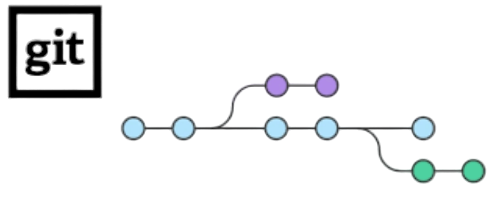

# [TP - PdeP Version Control (git)](https://docs.google.com/document/d/1kwGZ4euM5BwcnPnx1TO9tD6mFcHKPl59uQYIyyBVO_E/edit)

> Vamos a crear nuestro propio sistema de control de versiones, que permite administrar los sucesivos cambios que los usuarios hacen sobre sus archivos.

## Primera Parte
### Archivos y carpetas
Los archivos sobre los que se trabaja constan de un nombre que los identifica y un contenido que se puede representar mediante una cadena de caracteres. Los archivos están agrupados en una misma carpeta de la que también se conoce su nombre. No puede haber dos archivos llamados igual en una misma carpeta. 

_Se pide:_
1. Averiguar si una carpeta contiene un archivo con un nombre dado.

### Commits
Un commit da unidad a una serie de tareas que se realizan sucesivamente sobre una carpeta: tiene una descripción y el conjunto de cambios a realizar. Los cambios existentes son los siguientes, aunque en el futuro podría haber otros: 
- **Crear:** hace que aparezca el archivo con el nombre indicado y vacío de contenido. Si ya existe un archivo con ese nombre en la carpeta, no se puede realizar este cambio.
- **Eliminar:** hace que desaparezca el archivo de la carpeta. 
- **Vaciar:** hace que se eliminen todos los archivos de la carpeta
- **Agregar:** implica agregar el texto indicado al inicio del contenido del archivo.
- **Sacar:** implica sacar del contenido del archivo todos caracteres comprendidos entre dos posiciones numéricas dadas.

Salvo “Crear”, los demás cambios no pueden realizarse en caso que no exista en la carpeta ningún archivo cuyo nombre sea el indicado. Cuando un cambio no pueda realizarse queda todo igual.

_Se pide:_

1. Realizar un determinado cambio en una carpeta, en caso que se pueda realizar.
2. Dada una carpeta, efectuar todos los cambios de un commit que se puedan realizar, lo que implica obtener cómo queda dicha carpeta. Por ejemplo:
    > _En una carpeta vacía llamada “pdep” se aplican los 3 cambios de un commit con descripcion "commit inicial”: uno que crea el archivo “leeme.md”, otro que crea el archivo “parcial.hs” y otro que agrega “Este es un TP” al archivo “leeme.md”. Finalmente, la carpeta debe quedar con 2 archivos: “leeme.md” con el contenido “Este es un TP” y el archivo “parcial.hs” vacío._
3. Determinar si un commit es inutil para una carpeta, lo cual se deduce de que la carpeta quede igual que antes luego de "cometerlo". 
4. Determinar si un commit que resulta inutil para una carpeta, dejaría de serlo si se realizaran sus cambios en la misma carpeta en orden inverso.  

## Segunda Parte
### Branches

Una rama ("branch") es una forma de organizar los commits que representa la evolución de una carpeta a lo largo del tiempo. En particular, lo que da origen a su nombre, es permitir que haya bifurcaciones en la historia de commits, de manera que se forman diferentes branches con los primeros commits en común. (Es una suerte de multiuniverso o "elige tu propia aventura" donde la situación final de la carpeta depende de qué branch se considere). Para simplificar, a diferencia de lo que sucede en la realidad con git, en esta versión los branches nunca se juntan ("merge"), por lo que si bien dos commits diferentes pueden ser vistos como siguientes de un mismo commit, siempre cada commit tiene un único commit anterior. También, se debe poder diferenciar al commit inicial de los restantes, para identificar lo que sería la raíz del árbol.  

_Se pide:_

5. Hacer el checkout de una branch en una carpeta: Consiste en aplicar sucesivamente los cambios de todos los commits de la branch en la carpeta.
6. Conocer el log de un archivo a partir de una branch: Consiste en obtener una lista de los nombres de los commits de la branch que afectan a dicho archivo.

_Se pide:_
1. Definir las estructuras necesarias y funciones básicas para representar el nuevo modelo.
2. Hacer una nueva versión del checkout de una branch, en este caso a partir de un commit cualquiera, que implica aplicar sucesivamente los cambios desde dicho commit hasta el inicial. 

### Al infinito y más allá
3. Analizar qué sucedería con las funciones realizadas si sucede que:
- Un archivo tenga como contenido una lista infinita de caracteres
- Una carpeta tenga infinitos archivos
> Mostrar ejemplos de consulta y respuesta
